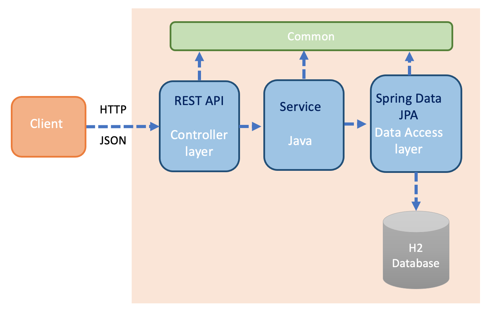
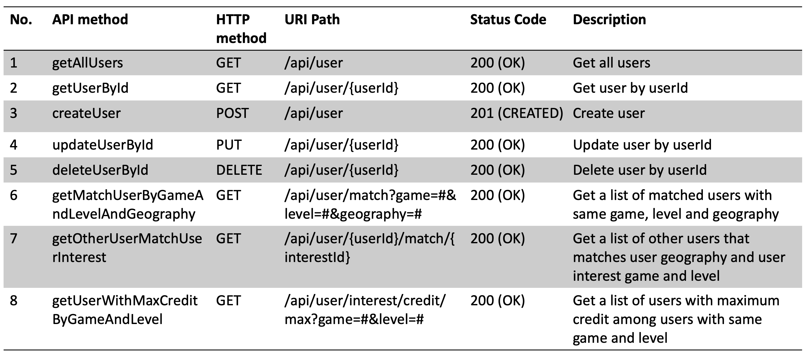
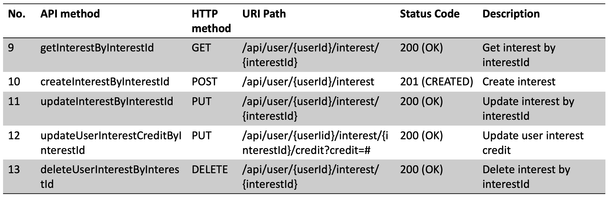
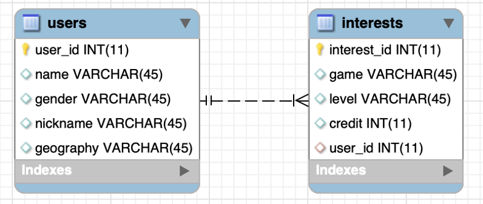
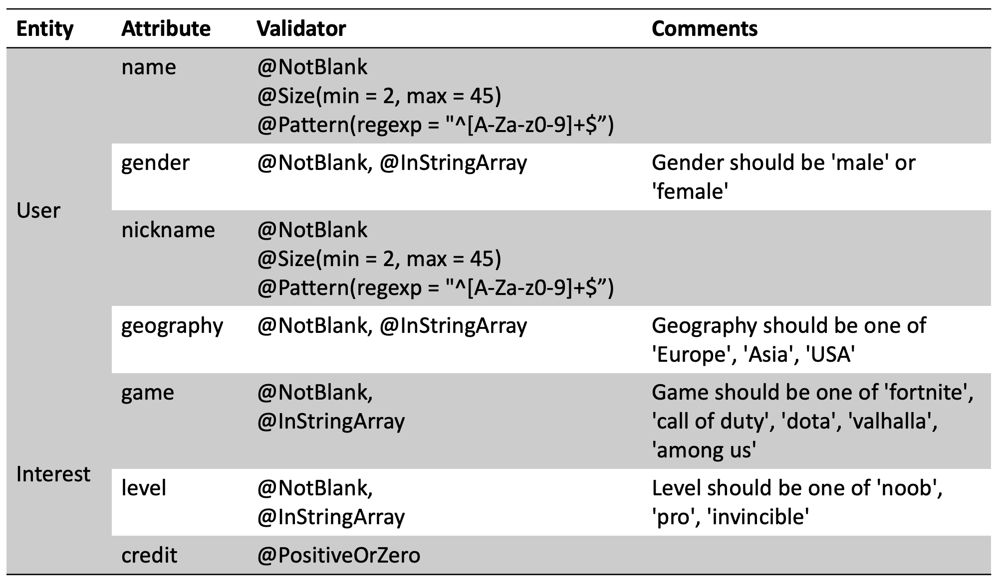
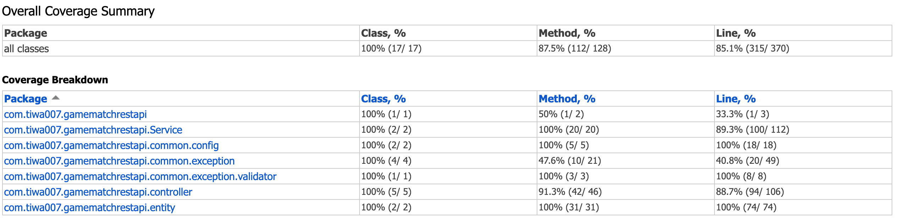

# REST APIs for game match

REST APIs to match users based on their interests for a centralized app of all games. 
Main features include:
- User and interest management 
- Game auto-matching based on user geography, interest game and interest level
- Search maximum credits based on user interest game and level

Slides used in the technical interview: [SlidesForAPIDesign.pdf](SlidesForAPIDesign.pdf)

### Built With
- [Java](https://www.java.com/en/) - Java 8
- [Spring Boot](https://spring.io/projects/spring-boot) - Spring Boot REST API
- [H2 Database](https://www.h2database.com/html/main.html) - In-memory database
- [Maven](https://maven.apache.org/) - Project management 

## Design

- [Architecture](#architecture)
- [REST API Design](#rest-api-design)
- [Service layer](#service-layer)
- [Unit testing](#unit-testing)

#### Architecture
The below image shows the high level architecture of the backend server.
- **Client**: The client side sends HTTP request to backend server. The data is transmitted using JSON format.
- **Controller layer**: The controller layer implements REST API.
- **Service layer**: The business logic of the system.
- **Data access layer**: The data access layer implements Spring Data JPA.
- **Data storage** The storage layer of the application uses in-memory H2 Database, a relational database
- **Common**: The Common component contains utility code (exception handling, configurations, etc.) used across the application.

##### Package overview:
- **`gamematchrestapi.controller`**: Provides the REST API.
- **`gamematchrestapi.service`**: Main logic of the application.
- **`gamematchrestapi.entity`**: Classes that represent persistable entities.
- **`gamematchrestapi.repository`**: Classes performs CRUD (Create, Read, Update, Delete) operations and act as the bridge to the H2 Database.
- **`gamematchrestapi.common`**:  Common component contains custom exceptions and configuration of Swagger 3 and CORS.

#### REST API Design
The following tables show the design of the REST API. The class ``UserController`` implements No. 1-8 API methods for ``User`` entity. 
The class ``InterestController`` implements No. 9-13 API methods for ``Interest`` entity. 

#### Service layer

The service layer handles the business logic of the system. 
It is responsible for: 
- Managing relationships between entities, i.e. logic for create/update/delete.
- Searching for desired user and interest

##### Datamodel
There are two entities: `User` and `Interest`. Entity `User` has name, gender, nickname and geography attributes. 
Entity `Interest` has game, level, credit attributes. Entity `User` have an one-to-many relationship with Entity `Interest`.

To ensure they are in a valid state, data was validated inside entities before creating/updating them. 
[Hibernate Validator](http://hibernate.org/validator/) and custom validator (`@InStringArray`) were used to 
validate application constraints as shown in the following table.

##### Policies

API for creating:
+ Attempt to create an entity with invalid data: Throws `MethodArgumentNotValidException`.

API for retrieving:
+ Attempt to retrieve an entity that does not exist: Throws `ResourceNotFoundException`.
+ Attempt to retrieve an entity with invalid request parameter: Throws `InvalidRequestException`.

API for updating:
+ Attempt to update an entity that does not exist: Throws `InvalidRequestException`.
+ Attempt to update an entity with invalid data: Throws `MethodArgumentNotValidException`.

API for deleting:
+ Attempt to delete an entity that does not exist: Throws `InvalidRequestException`.
+ Cascade policy: When a parent entity is deleted, entities that have with the deleted entity should also be deleted.

API usage was documented using ``Swagger 3`` and the document is available at http://localhost:8080/swagger-ui/#/ 
when the server is running.

#### Unit testing

- The controller classes were tested with Spring Boot and ``@WebMvcTest``
- In the data access layer, JPA Queries of the repository classes were tested with Spring Boot and ``@DataJpaTest``
- Integration Tests with ``@SpringBootTest``

The following image shows the coverage of the unit testing. The method and line coverage are above 85%.

##### Build the Project

``
mvn clean install
``

##### Run and test the service
To start the server, type ``
mvn spring-boot:run 
`` in the terminal from the root project directory. You can
change server port number by typing 
``
mvn spring-boot:run -Drun.arguments="--server.port=8080"
``. To exit the server, press ``ctrl-c``.\
\
To test the server, open a web browser to http://localhost:8080/swagger-ui/#/ using Swagger 3.0.

